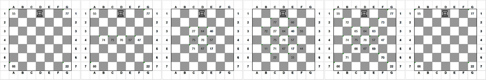

# **Manual de Utilizador**

  

    

## **Projeto - Epoca Especial (Jogo da Torre)**

### _Unidade Curricular: Inteligência Artificial_ &nbsp;2019/2020

**Realizado por**
- João dos Santos nº 
- Izilda Kossy nº 

**Docentes**
- Prof. 

## 1. Introdução

## 2. Início e caminho de ficheiro

## 3. Escolha de Tabuleiro

## 4. Escolha de Algoritmo

## 5. Finalização da pesquisa e escrita de resultados no ficheiro

## 6. Sair do programa

